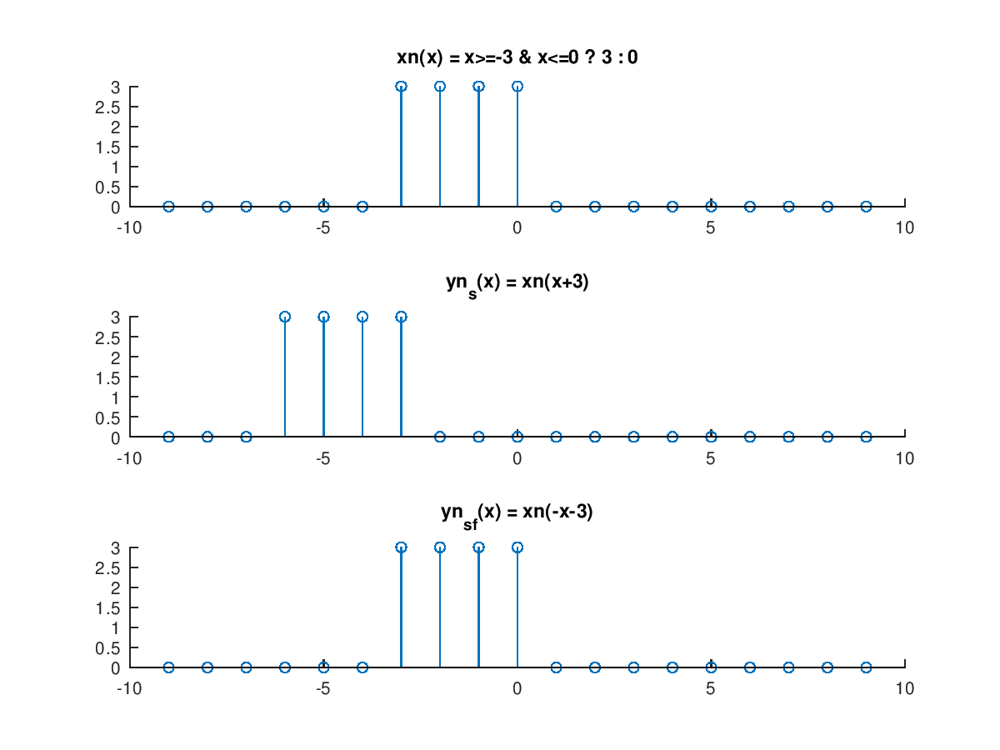

<!--
Berkas ini tidak ditujukan untuk dibaca menggunakan perangkat lunak penyunting teks. Jika anda bisa membaca ini, berarti anda sedang melakukan itu. Jika anda membuka berkas di VSCode, anda dapat menggunakan CTRL+SHIFT+V untuk me-render berkas markdown ini.
-->

**_MUHAMMAD AUFI RAYESA FRANDHANA_**<br/>
**_PemrSD112 Ilmu Komputer FMIPA UNJ_**<br/>
**_1313617014_**<br/>
**_PemrSD112 assignment chapter 1 (page 11 of module)_**

---

## _1. Jelaskan yang dimaksud dengan sinyal!_

Sinyal adalah bentuk kuantisasi informasi yang bermanifestasi dalam susunan/sekuens yang normalnya berbentuk fungsi yang melaju mengikuti waktu sebagai masukan. Nilai pada setiap waktu adalah unik, kecuali ketika kita mulai membicarakan teori kuantum yang memiliki konsep superposisi.

---

## _2. Jelaskan perbedaan sinyal analog dan sinyal digital !_

Perbedaan di antara sinyal analog dan sinyal digital terdapat pada aspek kuantisasinya. Sinyal analog dikeluarkan secara kontinu, dan sinyal digital dikeluarkan secara diskrit.

---

## _3. Proses sinyal pada soal dengan menggunakan MATLAB jika diinginkan!_

Saya tidak menggunakan MATLAB karena saya tidak mampu membeli MATLAB dan kampus tidak menyediakan MATLAB untuk mahasiswa di paket perangkat lunak mahasiswa yang didapatkan dari PUSTIKOM. Karenanya, **saya akan menggunakan Octave**.

`achap01_no03.m`
```matlab
function achap01_no03
    x = -9:9;
    xn = generate_xn(x);
    yn_s = generate_yn_shift(x);
    yn_s_f = generate_yn_shift_flip(x);

    subplot(3,1,1);
    stem(x,xn);
    title("xn(x) = x>=-3 & x<=0 ? 3 : 0");

    subplot(3,1,2);
    stem(x,yn_s);
    title("yn_s(x) = xn(x+3)");

    subplot(3,1,3);
    stem(x,yn_s_f);
    title("yn_s_f(x) = xn(-x-3)");
endfunction

function y = generate_xn (x)
    y = ((x>=-3) & (x<=0))*3;
endfunction

function y = generate_yn_shift (x)
    y = generate_xn(x+3);
endfunction

function y = generate_yn_shift_flip (x)
    y = generate_xn(-x-3);
endfunction
```

_Jika anda ingin menjalankan kode ini, anda bisa mengikuti instruksi pada `README.md` atau dokumentasi pada berkas kode sumbernya (`achap01_no03.m`)._

---

## _4. Beri 2 contoh aplikasi pengolahan sinyal pada bidang komunikasi data komputer!_

- Ponsel pintar dapat bertukar informasi melalui sinyal 4G antara piranti konsumen dengan berbagai piranti lainnya secara cepat.
- _Auto-encoder/decoder_ sinyal terenkripsi untuk mengirim dan menerima informasi yang tidak ingin diketahui orang lain di luar kelompok yang juga dapat menerima informasi terenkripsi tersebut.