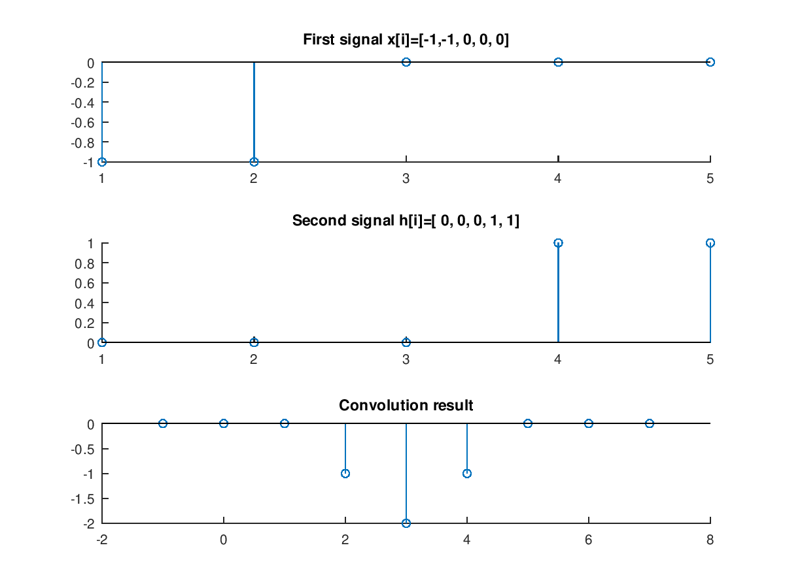

<!--
Berkas ini tidak ditujukan untuk dibaca menggunakan perangkat lunak penyunting teks. Jika anda bisa membaca ini, berarti anda sedang melakukan itu. Jika anda membuka berkas di VSCode, anda dapat menggunakan CTRL+SHIFT+V untuk me-render berkas markdown ini.
-->

**_MUHAMMAD AUFI RAYESA FRANDHANA_**<br/>
**_PemrSD112 Ilmu Komputer FMIPA UNJ_**<br/>
**_1313617014_**<br/>
**_PemrSD112 assignment chapter 2 (page 20 of module)_**

---

## _1. Jelaskan yang dimaksud sistem invarian terhadap waktu!_

Sistem invarian terhadap waktu adalah fungsi yang nilai keluarannya tidak unik atau konstan berapapun parameter masukan waktu yang diberikan.

---

## _2. Tentukan linieritas persamaan `y(t)=3*x(t)-z` dimana `x(t)` adalah sinyal masukan, `y(t)` adalah sinyal keluaran, dan `z` adalah konstanta!_

Singkatnya, persamaan tersebut linier hanya jika sinyal masukan `x(t)` adalah linier.

Pembuktian lebih menggunakan percobaan sifat aditif dan homogen dapat dilakukan namun sepertinya akan sangat, sangat _redundant_ jika dilakukan.

Asumsikan `y_2(t)` adalah sinyal keluaran yang dihasilkan dengan sinyal masukan `x_1(t)` \[**1**\] dan `y_1(t)` adalah sinyal keluaran yang dihasilkan dengan sinyal masukan `x_2(t)` \[**2**\].

Jika aditif, maka harus diambil asumsi `x(t) = x_1(t) + x_2(t)` \[**3**\] dan `y(t) = y_1(t) + y_2(t)` \[**4**\] untuk membuktikan `y(t) = 3*x(t)-z`.

dengan menjumlahkan \[**1**\] dan \[**2**\] dengan asumsi \[**4**\] kita akan mendapatkan:<br/>
`y(t) = 3*x_1(t) + 3*x_2(t) - z - z`<br/>
`y(t) = 3*(x_1(t) + x_2(t)) - 2z` \[**5**\]

Dengan mensubstitusi asumsi \[**3**\] ke \[**5**\], kita akan mendapatkan<br/>
`y(t) = 3*x(t) - 2z` \[**6**\] ***Persamaan tidak sama dengan persamaan awal, maka sistem tidak aditif.***

Untuk homogenitas, asumsikan kita menggunakan `x_1(t) = 2*x(t)` \[**7**\] sebagai sinyal masukan untuk membuktikan `y_1(t) = 2*y(t)` \[**8**\].

Jika \[**7**\] digunakan ke persamaan awal, kita mendapatkan<br/>
`y_1(t)= 6*x_1(t) - z`

dan dengan mengekspansi \[**8**\], kita mendapatkan<br/>
`y_1(t)= 6*x(t) - 2*z`

***karena hasil substitusi \[7\] dan ekspansi \[8\] tidak sama, maka sistem tidak homogen.***

Kesimpulan akhir: **Sistem tidak linier**.

---

## _3. Jelaskan prinsip kerja konvolusi (waktu diskrit)!_

Konvolusi pada konteks pemrosesan sinyal agak berbeda dari konvolusi pada umumnya yang biasanya diderivasi dari visi komputer. Konvolusi pada konteks ini bekerja dengan melakukan operasi jumlah produk elementer untuk mendapatkan deretan nilai dari sinyal awal dan sinyal akhir yang dibalik. Arah penggeseran indeks elemen pada sinyal awal akan selalu berlawanan. Operasi jumlah daro produk elementer dilakukan di indeks pertama pada sinyal pertama dan indeks terakhir pada sinyal kedua.

---

## _4. Proses sinyal pada soal dengan menggunakan MATLAB jika diinginkan!_

_Pembuktian manual_<br/>
Setidaknya, butuh 9 kali iterasi konvolusi dari dua sinyal yang masing-masing berukuran 5 dan 5 dalam satuan diskrit. Indeks disini mengasumsikan permulaan dimulai dari 1.

`i=1`
```
-1 -1  0  0  0
             1  1  0  0  0
-------------------------- sum of product
             0             = 0
```

`i=2`
```
-1 -1  0  0  0
          1  1  0  0  0
----------------------- sum of product
          0 +0          = 0
```

`i=3`
```
-1 -1  0  0  0
       1  1  0  0  0
-------------------- sum of product
      +0 +0 +0       = 0
```

`i=4`
```
-1 -1  0  0  0
    1  1  0  0  0
----------------- sum of product
   -1 +0 +0 +0    = -1
```

`i=5`
```
-1 -1  0  0  0
 1  1  0  0  0
-------------- sum of product
-1 -1 +0 +0 +0 = -2
```

`i=6`
```
   -1 -1  0  0  0
 1  1  0  0  0
----------------- sum of product
   -1 +0 +0 +0    = -1
```

`i=7`
```
      -1 -1  0  0  0
 1  1  0  0  0
-------------------- sum of product
       0 +0 +0       = 0
```

`i=8`
```
        -1 -1  0  0  0
1  1  0  0  0
---------------------- sum of product
         0 +0         = 0
```

`i=9`
```
           -1 -1  0  0  0
1  1  0  0  0
------------------------- sum of product
            0             = 0
```

Didapatkan deret konvolusi `[  0,  0,  0, -1, -2, -1,  0,  0,  0]`
```
   y= 2|
       |
   y= 1|
       |
y=0 ---+---#---#---#---+---+---+---#---#---#--
       |               |   |   |         
   y=-1|               #   |   #
       |                   |
   y=-2|                   #
```

_Pembuktian menggunakan MATLAB_<br/>
Saya tidak menggunakan MATLAB karena saya tidak mampu membeli MATLAB dan kampus tidak menyediakan MATLAB untuk mahasiswa di paket perangkat lunak mahasiswa yang didapatkan dari PUSTIKOM. Karenanya, **saya akan menggunakan Octave**.

`achap02_no04.m`
```matlab
function achap02_no04
    base = 1:5;
    base_nu = -1:7;
    x = [zeros(1,2),ones(1,3)]-1;
    h = [zeros(1,3),ones(1,2)];
    xh = conv(x,h);

    subplot(3,1,1);
    stem(base,x);
    title("First signal x[i]=[-1,-1, 0, 0, 0]");

    subplot(3,1,2);
    stem(base,h);
    title("Second signal h[i]=[ 0, 0, 0, 1, 1]");

    subplot(3,1,3);
    stem(base_nu,xh);
    title("Convolution result");
endfunction
```

_Jika anda ingin menjalankan kode ini, anda bisa mengikuti instruksi pada `README.md` atau dokumentasi pada berkas kode sumbernya (`achap02_no04.m`)._